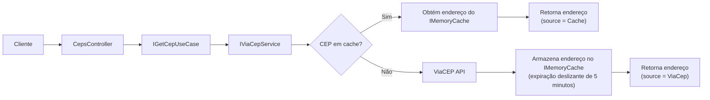

# Find CEP

Find CEP é uma API REST desenvolvida em **C#**, utilizando **.NET 8** e
**ASP.NET Core**, para consulta de endereços a partir de um CEP por meio
da API pública do ViaCEP.

A aplicação foi estruturada seguindo princípios de **Clean
Architecture** e aplicando princípios do **SOLID**, principalmente
**Separação de Responsabilidades (SRP)** e **Inversão de Dependência
(DIP)**, promovendo baixo acoplamento, organização e facilidade de
manutenção.

## Fluxo da aplicação



## Funcionalidades

-   Consulta de endereços por CEP
-   Integração com ViaCEP
-   API Key Authentication
-   Cache com IMemoryCache (5 minutos)
-   Swagger/OpenAPI
-   Testes unitários

## Tecnologias

-   C#
-   .NET 8
-   ASP.NET Core
-   Swagger/OpenAPI
-   API Key Authentication
-   IMemoryCache
-   xUnit

## Arquitetura

``` text
FindCep
├── FindCep.Api
├── FindCep.Application
├── FindCep.Infrastructure
└── FindCep.Tests
```

### FindCep.Api

-   Controllers
-   Configuração da aplicação
-   Autenticação
-   Swagger
-   Injeção de dependências

### FindCep.Application

-   Casos de uso
-   Orquestração da aplicação
-   DTOs
-   Interfaces

### FindCep.Infrastructure

-   Integração com ViaCEP
-   Comunicação HTTP
-   Cache

### FindCep.Tests

-   Testes unitários

## Como executar

Pré-requisito: .NET 8 SDK

``` bash
git clone https://github.com/KelvinRian/find-cep.git
cd find-cep/FindCep
dotnet restore
dotnet run --project FindCep.Api
```

## Configuração da API Key

Em find-cep/FindCep/FindCep.Api
``` bash
dotnet user-secrets init
dotnet user-secrets set "Authentication:ApiKey" "your-api-key"
```

Header:

``` http
X-Api-Key: your-api-key
```

## Swagger

Disponível em:

``` text
/swagger
```

## Endpoint

``` http
GET /api/ceps/{cep}
```

## Postman

A collection Postman está disponível na raíz do projeto.

Antes de executar as requisições, informe o valor do header `X-Api-Key`.

## Validações

-   CEP obrigatório
-   8 dígitos numéricos ou 8 digitos númericos mais um hífen
-   404 para CEP inexistente
-   401 para API Key inválida

## Cache

As respostas permanecem em cache por 5 minutos e o campo `source`
informa se os dados vieram do ViaCEP ou do cache.

## Testes

Em find-cep/findcep
``` bash
dotnet test
```

## Decisões técnicas

-   Clean Architecture
-   API Key Authentication
-   IMemoryCache
-   HttpClient via Dependency Injection

## Possíveis melhorias

-   Docker
